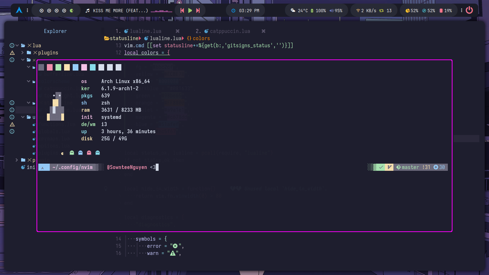

<div align="center">
    <h1>Arch Linux - Catppuccin Mocha Mauve</h1>
    <h1>by Nguyen Thanh Son | @SownteeNguyen</h1>
</div>

<div align="center">


[](https://github.com/SownteeNguyen/dotfiles)
<a href="https://github.com/SownteeNguyen/dotfiles/issues">

</a>

</div>

## More Screenshots


### Details

 

- **Window Manager**: I3
- **Window Manager Theme**: Catppuccin Mocha Mauve
- **OS**: Arch Linux
- **Terminal**: Kitty
- **Shell**: Zsh
- **Run Launcher**: Rofi
- **Audio Visualizer**: Cava
- **Notifications**: Dunst
- **System Monitor**: GTK 3
- **Editor**: Neovim

## Setup 🔧:

<details><summary>Package and Applications</summary><blockquote>

#### Font

    yay -S ttf-iosevka-nerd ttf-font-awesome ttf-jetbrains-mono-nerd nerd-fonts-sf-mono noto-fonts noto-fonts-cjk

#### Apps for Code

- Visual Studio Code
- Intelij IDea Ultimate Edition
- Webstorm
- NeoVim
  ```
  yay -S visual-studio-code-bin intellij-idea-ultimate-edition webstorm neovim
  ```

#### Other Apps

- Telegram
- Discord (BetterDiscord)
- Thunar
- OBS
- VLC
  ```
  sudo pacman -S  discord vlc thunar obs-studio telegram-desktop
  ```
- Spotify (Spicetify)
- Chrome
- EDGE
  ```
  yay -S google-chrome microsoft-edge-stable-bin spotify
  ```

#### Library Support

    sudo pacman -S nodejs npm python python-pip clang jdk-openjdk

#### Network

    sudo pacman -S netctl networkmanager network-manager-applet ifplugd dhcpcd dialog wpa_suppllicant wireless_tools

#### Audio

    sudo pacman -S pavucontrol pipewire pipewire-alsa pipewire-audio pulseaudio pulseaudio-bluetooth playerctl

    systemctl --user enable pipewire pipewire-pulse && systemctl --user start pipewire pipewire-pulse

#### Power

    sudo pacman -S acpi libnotify

#### Bluetooth

    sudo pacman -S bluez bluez-utils bluez-tools bluez-libs

    sudo systemctl enable bluetooth.service

    sudo echo AutoEnable = True >> /etc/bluetooth/main.conf

#### Brightness

    sudo pacman -S brightnessctl xorg-xbacklight

#### File Manager

    sudo pacman -S ranger ueberzug exa hightlight unzip

#### Monitor and Theme

    sudo pacman -S feh flameshot lxappearance catppuccin-gtk-theme-mocha papirus-icon-theme papirus-folders-catppuccin-git neofetch rxfetch nitch

#### Other

    sudo pacman -S gnome-keyring libsecret libgnome-keyring seahorse xf86-input-libinput pacman-contrib lightdm btop fontconfig ibus

    sudo systemctl enable lightdm

    lightdm --test-mode --debug

    sowntee ALL=(ALL:ALL) NOPASSWD: /usr/bin/systemctl reboot, /usr/bin/systemctl poweroff

    source /etc/X11/xinit/xinitrc.d/50-systemd-user.sh
    eval $(/usr/bin/gnome-keyring-daemon --start)
    export SSH_AUTH_SOCK
    mkdir -p "$HOME"/.local/share/keyrings

</blockquote></details>

## NeoVim

### Screenshoot





<details><summary>NeoVim</summary><blockquote>
- You probably notice you don't have support for copy and paste also that python and node haven't been setup
  
  - If you on X11 install xsel and xclip
    
    ```
    sudo pacman -S xsel xclip
    ```

- Next we need to install python support (Node is optional)
  - Neovim python support:
  ```
  pip install pynvim
  ```
  - Neovim Node support
  ```
  npm i -g neovim
  ```
- Other dependencies for formatting & finding text :

  - Prettier

  ```bash
  npm install -g prettier
  ```

  - Ripgrep Fzf Lazygit

  ```
  sudo pacman -S ripgrep fzf lazygit
  ```

</details>
</blockquote></details>
